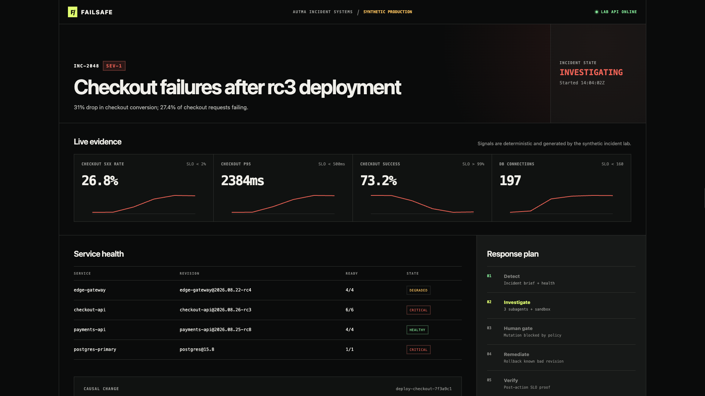
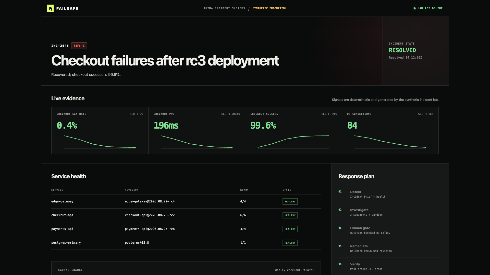
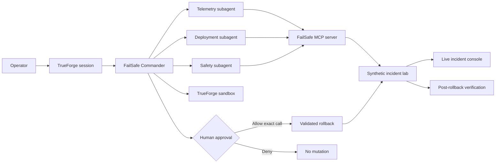

# FailSafe

> **The incident-response agent you can trust with root.**

FailSafe is a TrueForge-powered incident commander that earns permission to act. It gathers evidence through a real MCP server, delegates focused investigations to dynamic subagents, executes generated analysis code in a sandbox, pauses before destructive remediation, and verifies recovery from post-action signals.

The included checkout outage is deterministic and explicitly synthetic. It is designed to make every part of the agent harness visible, repeatable, and safe to judge.

## Judge this in 60 seconds

1. Watch the [three-minute demo](https://youtu.be/WHKEKvfC-dI).
2. Open the [judges' guide](docs/judges-guide.md) for a criterion-by-criterion evidence map.
3. Inspect the [threat model](docs/threat-model.md) and checked-in [TrueForge agent manifest](trueforge/failsafe-agent.json).
4. Run `pnpm install && pnpm check` to execute the complete 17-test gate.
5. Read the public [field report](docs/field-report.md) for the architecture, failures, fixes, and design reasoning.

FailSafe is strongest when judged as one complete control loop: **observe, delegate, calculate, ask, act, verify**.

## Demo

- Three-minute video: [FailSafe: The Incident Agent You Can Trust With Root](https://youtu.be/WHKEKvfC-dI)
- Reproducible runbook: [`docs/demo-runbook.md`](docs/demo-runbook.md)
- Judging evidence map: [`docs/judges-guide.md`](docs/judges-guide.md)
- Public field report: [`docs/field-report.md`](docs/field-report.md)
- Safety analysis: [`docs/threat-model.md`](docs/threat-model.md)

The video uses the same deterministic synthetic incident and checked-in TrueForge agent manifest. It does not claim access to a production system.



<details>
<summary>Verified recovery state</summary>



</details>

## What the demo proves

One incident produces five visible proof moments:

1. **Real MCP evidence** from health, metrics, logs, deployments, and diffs.
2. **Three focused subagents** investigating telemetry, deployment causality, and remediation safety.
3. **Generated sandbox code** correlating the deployment and failure windows.
4. **A real human approval object** that blocks rollback before execution.
5. **Measured recovery verification** using signals timestamped after remediation.

## Why this cannot be a chatbot

TrueForge is not hidden under a chat wrapper. It owns the behaviors that make the project qualify:

- MCP discovery and classified tool execution
- exactly three bounded dynamic subagents
- generated Python running in the local sandbox
- a real approval object that intercepts the rollback tool call
- session and pending-approval continuity across reconnects
- the recovery turn and event history after mutation

Removing TrueForge removes the safety and orchestration properties the project is demonstrating.

## The incident

At 14:02 UTC, `checkout-api@2026.08.26-rc3` reaches production. It increases each replica's database pool from 20 to 80 connections while reducing acquisition timeout from 2 seconds to 250 milliseconds. Six replicas can now demand 480 connections from a database capped at 200.

Within two minutes:

- checkout 5xx rate reaches **27.4%**
- checkout p95 reaches **2,420ms**
- PostgreSQL reaches **198 / 200** active connections
- checkout conversion drops **31%**

A restart leaves the bad configuration active. Only a validated rollback to `checkout-api@2026.08.26-rc2` restores service.

## Architecture



## Quick start

### Prerequisites

- Node.js 22 or newer
- pnpm 11
- a supported model provider configured in TrueForge

### 1. Install and verify

```bash
pnpm install
pnpm check
```

### 2. Start FailSafe

```bash
pnpm start
```

Open the incident console at <http://localhost:3100>.

### 3. Start TrueForge

In another terminal:

```bash
npx @truefoundry/trueforge --port 8790
```

Configure a model provider in TrueForge Settings. The checked-in manifest defaults to `openrouter/gemini-2.5-flash`, but any configured supported model can be selected without editing files:

```bash
FAILSAFE_MODEL=provider/model pnpm trueforge:configure
```

The configuration script:

- verifies the selected model exists
- creates or replaces the `failsafe-incident-lab` MCP connector
- requires approval for `@write` and `@destructive` tools
- verifies all 10 tools are discoverable
- creates or updates the `failsafe-commander` saved agent
- enables the local sandbox and dynamic subagents

Open TrueForge at <http://localhost:8790> and select **failsafe-commander**.

### 4. Run the incident

```text
Investigate synthetic incident INC-2048. Use exactly three parallel subagents for telemetry, deployment causality, and remediation safety. Use the sandbox for one correlation calculation. Gather evidence, choose the smallest safe action, then initiate the exact remediation tool call so TrueForge creates a real approval gate. Do not claim recovery until measured verification passes.
```

Use [`docs/demo-runbook.md`](docs/demo-runbook.md) for the exact three-minute sequence.

### 5. Reset

```bash
pnpm demo:reset
```

The fixture returns to `investigating` on rc3, ready for another run.

## MCP tool surface

| Tool | Purpose | Policy annotation |
|---|---|---|
| `incident_brief` | Read incident scope and impact | read-only |
| `service_health` | Inspect current service health | read-only |
| `metrics_query` | Query deterministic metric series | read-only |
| `logs_search` | Search correlated service logs | read-only |
| `recent_deployments` | List recent deployment activity | read-only |
| `deployment_diff` | Inspect the suspected configuration change | read-only |
| `timeline_record` | Add an audit note | write, approval required |
| `restart_service` | Demonstrate an insufficient remediation | destructive, approval required |
| `rollback_deployment` | Restore the last known-good revision | destructive, approval required |
| `verify_recovery` | Evaluate post-action SLO gates | read-only |

## Safety guarantees

- The environment is labeled **synthetic** in the UI, agent instructions, and runbook.
- The HTTP and MCP server binds only to `127.0.0.1`; it is not exposed to the LAN.
- Read tools cannot mutate state.
- Every write or destructive tool used through FailSafe Commander is blocked by TrueForge approval policy. Direct MCP access remains a local test interface only.
- Rollback rejects the wrong service, deployment ID, or target revision.
- Repeating an approved rollback is idempotent.
- A restart cannot falsely heal the fixture.
- Recovery cannot pass until rollback is applied.
- Rollback alone does not close the incident; only an explicit `verify_recovery` call records resolution after all four gates pass.
- Recovery samples occur from `14:11:10Z` through `14:11:50Z`, after rollback at `14:11:00Z` and before verification at `14:12:00Z`.
- No model or provider credentials are stored in this repository.

## HTTP endpoints

| Route | Method | Purpose |
|---|---|---|
| `/` | GET | Responsive incident console |
| `/api/health` | GET | Process readiness |
| `/api/state` | GET | Current deterministic incident state |
| `/api/reset` | POST | Reset the synthetic fixture |
| `/mcp` | POST | Stateless Streamable HTTP MCP endpoint |

## Development

```bash
pnpm dev                 # watch TypeScript server
pnpm lint                # ESLint
pnpm typecheck           # strict TypeScript
pnpm test:run            # deterministic unit + integration tests
pnpm test:run --coverage # V8 coverage
pnpm build               # clean production compile
pnpm check               # complete local gate
```

GitHub Actions runs the same `pnpm check` gate on every pull request and push to the contest branches.

The verified gate currently covers:

**19 passing tests** across unit, HTTP, MCP, server-binding, and monotonic-timeline behavior.

- state transitions and unsafe rollback refusal
- restart-without-recovery behavior
- post-rollback evidence timing
- MCP tool discovery, annotations, calls, and error responses
- dashboard and static asset delivery
- Host and Origin rejection for the loopback-only mutation surface
- JSON-RPC parse errors plus health, state, 404, and complete method-policy routes
- clean compiled startup and remote Streamable HTTP discovery

## Repository layout

```text
.github/workflows/       visible CI gate
public/                  incident console
src/incident/            deterministic incident state machine
src/mcp/                 MCP tool definitions and server
scripts/                 reset and TrueForge configuration
trueforge/               secret-free saved-agent manifest
tests/                   unit and integration verification
docs/                    demo runbook and implementation plan
```

## Qodo Code Review Evidence

Every substantive implementation change was kept in [PR #1](https://github.com/charannyk06/failsafe-trueforge/pull/1) until Qodo's review and remediation loop completed. The initial Qodo review produced six actionable findings: one High, four Medium, and one Low. All six were treated as valid and fixed; none were dismissed.

- **High, fixed:** [resolution bypassed explicit verification](https://github.com/charannyk06/failsafe-trueforge/pull/1#discussion_r3867701562). Rollback now leaves the incident investigating, reports recovery as pending, and only `verify_recovery` records the recovery event and resolved timestamp.
- **Medium, fixed:** [restart logs moved backward](https://github.com/charannyk06/failsafe-trueforge/pull/1#discussion_r3867701566) and [pre-rollback verification timestamps could predate evidence](https://github.com/charannyk06/failsafe-trueforge/pull/1#discussion_r3867701582). Action logs and verification now derive from the latest evidence timestamp and remain monotonic.
- **Medium, fixed:** [malformed MCP JSON escaped JSON-RPC](https://github.com/charannyk06/failsafe-trueforge/pull/1#discussion_r3867701570). Parse failures now return a protocol-shaped `-32700` error.
- **Medium, fixed:** [the supported Node range was overstated](https://github.com/charannyk06/failsafe-trueforge/pull/1#discussion_r3867701574). The package and setup guide now require Node.js 22 or newer, matching TrueForge's current prerequisite.
- **Low, fixed:** [unsupported MCP methods returned inconsistent errors](https://github.com/charannyk06/failsafe-trueforge/pull/1#discussion_r3867701587). Every non-POST method now returns `405` with `Allow: POST`.
- **Additional hardening:** an independent security pass found that a hostile browser Origin could reach the loopback mutation surface. Non-loopback Origins are now rejected before JSON parsing, with regression coverage.
- **Dismissed findings:** none.
- **Follow-up:** `/agentic_review` was triggered on this exact remediation and evidence head. The final Qodo result and public discussion trail are attached to PR #1; merge remained blocked until that follow-up completed.

## AI tool-use disclosure

AI coding agents were used to help research TrueForge, plan the project, write implementation code, and review changes. All generated work was inspected, executed, tested, and corrected against real runtime output. The implementation does not claim fabricated tool results, production connectivity, or recovery evidence.

## License

MIT © 2026 AUTMA LLC
