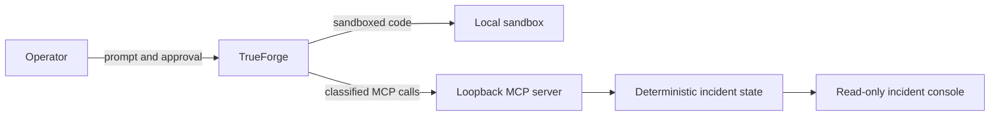

# FailSafe Threat Model

## Scope

FailSafe is a deterministic synthetic incident lab. It demonstrates how a TrueForge agent can investigate, request approval, remediate, and verify recovery without connecting to production infrastructure.

## Assets worth protecting

- the operator's authority to approve or deny a mutation
- the integrity of the incident evidence and audit timeline
- the exact remediation target
- the local host running generated analysis code
- model and provider credentials configured outside the repository

## Trust boundaries

TrueForge is the policy boundary. It intercepts write and destructive MCP calls from the saved FailSafe agent. The MCP server is a local test surface and therefore binds only to loopback.

## Threats and mitigations

| Threat | Impact | Mitigation | Verification |
|---|---|---|---|
| A read tool mutates state | Evidence gathering changes the incident | All seven read tools carry `readOnlyHint: true`; tests assert the complete annotation matrix | `tests/mcp-server.test.ts` |
| A destructive call executes without consent | Unauthorized rollback or restart | Saved agent requires approval for `@write` and `@destructive`; demo shows a real approval object | `trueforge/failsafe-agent.json`, demo 1:40 |
| A model targets the wrong service or revision | Wrong component is changed | Rollback validates service, deployment ID, and target revision | `src/incident/incident-store.ts` |
| A repeated approval applies rollback twice | Duplicate mutation corrupts state | Rollback is idempotent and returns the existing operation | Incident-store tests |
| A restart is mistaken for recovery | Bad configuration remains active | Restart preserves rc3; `verify_recovery` remains false | Incident-store tests |
| Stale metrics certify recovery | False success after remediation | Recovery samples occur after the rollback timestamp and before verification | Timing assertions in tests |
| Generated code touches the host | Analysis can damage local files | Correlation code runs in the TrueForge sandbox | Demo 1:20 |
| A LAN or hostile browser client calls the unauthenticated MCP or reset endpoint | External mutation or fixture reset | Server binds to `127.0.0.1`; Host and Origin handling rejects non-loopback access before body parsing | HTTP and server-binding tests |
| Timeline entries move backward | Misleading audit order | Custom events advance from the latest event with real date arithmetic | Monotonic-timeline tests |
| Credentials leak through source or demo | Account compromise | Provider credentials stay in TrueForge settings; repo and video use synthetic data only | Public repository and release QA |

## Residual risk

This repository is a lab, not a production control plane. Direct MCP access does not carry TrueForge's approval policy, which is why the server is loopback-only. A production deployment would additionally require authenticated service-to-service transport, authorization scoped to incident roles, signed audit records, secret management, rate limits, and a provider-specific rollback adapter.

## Safety claim

FailSafe does not claim that an LLM can be trusted with unrestricted root access. It demonstrates a narrower claim: an agent can be given bounded authority when evidence collection, code execution, human consent, exact targeting, and post-action verification are enforced by the harness around the model.
